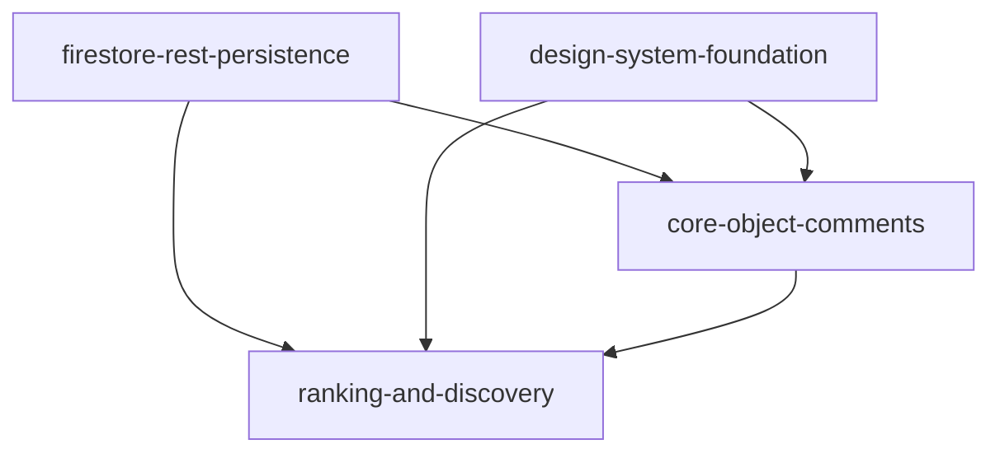

# OpenSpec Specs Index

## Objetivo

Centralizar el alcance y dependencias de las capabilities para implementar con agentes de forma consistente.

## Capabilities

- `core-object-comments`: quejas por objeto/seccion, hilos, likes, reglas de borrado/edicion.
- `ranking-and-discovery`: quejas destacadas (top 5) y vista completa paginada (30).
- `firestore-rest-persistence`: persistencia Firestore REST, CRUD, consultas y degradacion controlada.
- `design-system-foundation`: tokens y base visual comun para sidebar, popup y ranking.

## Dependencias

## Orden recomendado de implementacion

1. `design-system-foundation`
2. `firestore-rest-persistence`
3. `core-object-comments`
4. `ranking-and-discovery`

## Alcance funcional consolidado

- Alias local y modo queja activo en flujos de quejas/respuestas.
- Marcadores agrupados por seccion con conteo.
- Reglas de negocio: borrar propio, no editar propio, no like propio.
- Destacadas en sidebar: top 5 por likes y vista completa paginada de 30.
- Paleta unificada por tokens semanticos.
